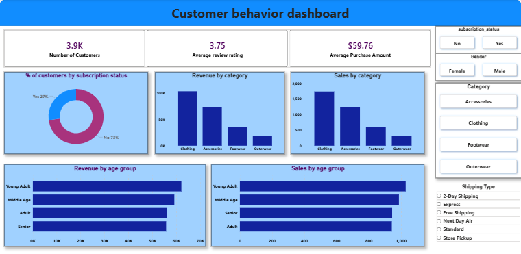

## 🛍️ Customer Behavior Analytics — End-to-End Cloud Data Pipeline
## Python | Neon PostgreSQL | SQL | Power BI


## 📌 Project Overview

A professional end-to-end data analytics pipeline analyzing **3,900 customer records across 25 products, 4 categories, and 50 U.S. states** — generating **$233K in total revenue insights** through Python-based ETL, Cloud Data Warehousing, and interactive Business Intelligence dashboarding.

**Tech Stack:**
- **Python** (Pandas, SQLAlchemy) — Data Cleaning, Feature Engineering, ETL
- **Neon.com** — Serverless PostgreSQL Cloud Database
- **Google Colab** — Cloud Development Environment
- **SQL** — CTEs, Window Functions, Case Statements, Data Segmentation
- **Power BI** — Interactive Executive Dashboard

---

## 🏗️ Project Architecture

```
Raw Dataset (3,900 records | 18 features)
        ↓
Python (Data Cleaning + Feature Engineering)
        ↓
Neon Serverless PostgreSQL (Cloud Data Warehouse)
        ↓
SQL (10 Business Intelligence Queries)
        ↓
Power BI (Interactive Dashboard)
```

---

## 📊 Dataset Overview

| Metric | Value |
|--------|-------|
| Total Customers | 3,900 |
| Total Revenue | $233,081 |
| Avg Purchase Amount | $59.76 |
| Avg Review Rating | 3.71 / 5.0 |
| Unique Products | 25 |
| Product Categories | 4 (Clothing, Accessories, Footwear, Outerwear) |
| U.S. States Covered | 50 |
| Payment Methods | 6 |
| Seasons Covered | 4 (Spring, Summer, Fall, Winter) |
| Discount Applied | 1,677 customers (43.0%) |
| Subscribed Customers | 1,053 (27.0%) |

---

## ⚙️ Data Pipeline Workflow

 1. 🔹 Data Engineering & ETL (Python)
- **Data Cleaning:** Handled missing values, standardized schema for SQL injection
- **Feature Engineering:** Prepared dataset for relational cloud storage
- **Cloud Integration:** Established secure connection between **Google Colab and Neon Serverless PostgreSQL** — solving the cloud-to-cloud connectivity challenge without a local server

 2. 🔹 Cloud Data Warehousing (SQL)
Solved **10 critical business questions** on the cloud-hosted database:

| Query | Technique | Key Finding |
|-------|-----------|-------------|
| Revenue by Gender | GROUP BY + SUM | Male: $157,890 vs Female: $75,191 |
| Discount vs High Spenders | Subquery | 1,677 customers (43%) used discounts |
| Top 5 Rated Products | AVG + ORDER BY | Top products identified by avg rating |
| Shipping Type Comparison | GROUP BY + AVG | Express $60.48 vs Standard $58.46 |
| Subscriber Spend Analysis | GROUP BY + COUNT | 1,053 subscribers vs 2,847 non-subscribers |
| Discount Rate by Product | CASE + ROUND | Top 5 discount-heavy products identified |
| Customer Segmentation | CTE + CASE | New (83) \| Returning (701) \| Loyal (3,116) |
| Top 3 Products per Category | CTE + ROW_NUMBER | Window Function ranking across 4 categories |
| Repeat Buyer Subscription | WHERE + GROUP BY | 89.1% of customers are repeat buyers |
| Revenue by Age Group | GROUP BY + SUM | Age-based revenue distribution identified |

 3. 🔹 Business Intelligence (Power BI)
Connected Neon Cloud DB to Power BI for interactive dashboard:
- **Executive KPIs:** Total Revenue, Avg Rating, Subscription Rate, Avg Purchase
- **Operational Insights:** Shipping efficiency, regional sales, category performance

---

## 📈 Key Business Insights

| Finding | Metric | Impact |
|---------|--------|--------|
| Top Revenue Category | Clothing — $104,264 (44.7%) | Focus inventory on Clothing |
| Customer Loyalty | 3,116 Loyal customers (79.9%) | High retention base |
| Gender Revenue Gap | Male ($157,890) vs Female ($75,191) | Target female segment |
| Shipping Insight | Express vs Standard — only $2.02 gap | Speed over spending motivator |
| Subscription Revenue | Non-subscribers drive $170,436 (73.1%) | Improve subscription value |
| Discount Usage | 43% customers used discounts | Re-evaluate discount strategy |
| Repeat Buyers | 89.1% repeat purchase rate | Strong customer loyalty signal |

---

## 📂 File Structure

```
📁 Customer-Behavior-Analytics
├── customer_behavior.ipynb        # Python ETL + Cloud DB connection
├── customer_behavior.sql          # 10 Business Intelligence queries
├── customer_behavior_dashboard.pbix  # Power BI dashboard file
├── customer_shopping_behavior.csv    # Raw dataset
└── customer_behavior_dash.png     # Dashboard preview
```

---

## 🚀 How to Use

1. Run **customer_behavior.ipynb** to view ETL process and Neon PostgreSQL connection
2. Import **customer_behavior.sql** into any PostgreSQL environment to test queries
3. Open **customer_behavior_dashboard.pbix** in Power BI Desktop to explore dashboard

---

 📸 Dashboard Preview



